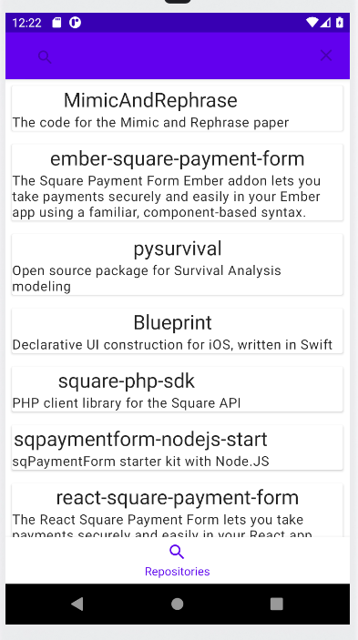

# poqRepositories
Demo of app built with MVI, Clean Architecture, Dagger Hilt and Coroutines &amp; Flows

This was a submission for a Kata  for poq.
It required a complete Android application that would download a list of repositories from GitHub and display them in a RecyclerView.
This is a good demonstration of the work I have lately been doing, following best practices, but the UI was not given any love.

